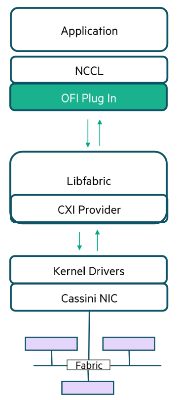
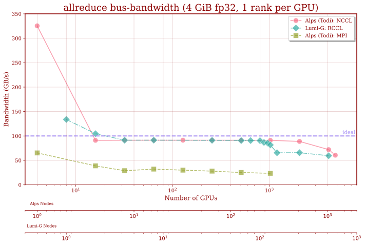

<!-- _paginate: skip  -->
<!-- _class: titlecover -->
<!-- _footer: "" -->

<div class="twocolumns">
<div>

# **Userlab Day 2024**

### NCCL

#### CSCS


</div>
<div>


</div>
</div>

---

# NVIDIA Collective Communication Library (NCCL)

- inter-GPU (collective) communication primitives

| Broadcast     | Reduce | AllReduce | AllGather |   ReduceScatter  | Send/Recv |
|---|---|---|---|---|---|

- single kernel implementation for communication and computation
- topology-aware, supports NVLINK
- API is similar to MPI (non-blocking version, e.g. `MPI_Isend`)
- bootstrap for parallel environment is out-of-band (not provided)
- can be used in combination with MPI
- collectives may be faster than GPU-aware MPI
- often used in AI applications (PyTorch, Keras or TensorFlow)
- can be used for HPC applications, too!
- AMD's version: RCCL

---

# Example: Allreduce

```c++
ncclResult_t ncclAllReduce(const void* sendbuff, void* recvbuff, size_t count, ncclDataType_t datatype, ncclRedOp_t op,
                           ncclComm_t comm, cudaStream_t stream)
```

<div class="twocolumns">
<div>

## Collectives API

- all NCCL functions return an error code
(no error: `ncclSuccess`)
- `buff`, `count`, `datatype`, `op` similar to MPI calls
- `comm`: NCCL communicator associated with
exactly 1 GPU
- `stream`: needs a CUDA stream to enqueue kernels
- no tag matching

</div>
<div>

## Asynchronous Semantics

- NCCL call returns
    - when the operation has been enqueued on the CUDA stream (*blocking* communicator)
        - may block the host thread before enqueueing
          (e.g. waiting for other ranks)
    - even before (*non-blocking* communicator)
        - requires waiting on communicator later on
- operation is executed asynchronously on devices
    - status can be checked using CUDA queries on the stream (e.g. using events)
    - `cudaStreamSynchronize` ensures completion of the collective

</div>
</div>

---

# Group Calls: Avoiding Deadlocks

- single thread manages multiple devices
    - each device has its own communicator (and stream)
- sequential operations can deadlock (blocking semantics)

```c++
for (int i=0; i<nLocalDevs; i++) {
    ncclAllReduce(..., comm[i], stream[i]);
}
```

- solution: use group calls

```c++
ncclGroupStart();
for (int i=0; i<nLocalDevs; i++) {
    ncclAllReduce(..., comm[i], stream[i]);
}
ncclGroupEnd();
```

- effectively makes NCCL functions non-blocking (with a *blocking* communicator)
    - NCCL kernels may not be enqueued on the stream after function returns
    - synchronizing the stream can only be done after `ncclGroupEnd()`

---

# Group Calls: Aggregating Operations

- aggregate communication operations -> single NCCL kernel launch: reduced overhead
- requires version 2.2 and later
- simply enclose operations by group calls

```c++
ncclGroupStart();
ncclBroadcast(sendbuff1, recvbuff1, count1, datatype, root, comm, stream);
ncclAllReduce(sendbuff2, recvbuff2, count2, datatype, comm, stream);
ncclAllReduce(sendbuff3, recvbuff3, count3, datatype, comm, stream);
ncclGroupEnd();
```

<div class="twocolumns">
<div>

- multiple streams are allowed
    - will enforce a stream dependency
    - blocks all streams until the NCCL kernel completes

```c++
ncclGroupStart();
ncclBroadcast(sbuff1, rbuff1, count1, dtype, root, comm, stream1);
ncclAllReduce(sbuff2, rbuff2, count2, dtype, comm, stream2);
ncclAllReduce(sbuff3, rbuff3, count3, dtype, comm, stream3);
ncclGroupEnd();
```

</div>
<div>

- aggregation with multiple comms is allowed
    - may use nested group calls (optional)

```c++
ncclGroupStart();
for (int i=0; i<nlayers; i++) {
    ncclGroupStart();
    for (int g=0; g<ngpus; g++) {
        ncclAllReduce(sbuffs[g]+offsets[i], rbuffs[g]+offsets[i],
            counts[i], datatype[i], comms[g], streams[g]);
    }
    ncclGroupEnd();
}
ncclGroupEnd();
```

</div>
</div>

---

# Group Calls: Point-to-Point Communications

- Point-to-Point requires version 2.7 and later
```c++
ncclResult_t ncclSend(const void* sendbuff, size_t count, ncclDataType_t datatype, int peer, ncclComm_t comm, cudaStream_t stream)
ncclResult_t ncclRecv(void* recvbuff, size_t count, ncclDataType_t datatype, int peer, ncclComm_t comm, cudaStream_t stream)
```

- use group calls to fuse multiple sends/recvs
    - form more complex communication patterns
    - scatter, gather, all-to-all, halo-exchange

```c++
ncclGroupStart();
if (rank == root) {
    for (int r=0; r<nranks; r++)
        ncclSend(sendbuff[r], size, type, r, comm, stream);
}
ncclRecv(recvbuff, size, type, root, comm, stream);
ncclGroupEnd();
```

---

# Group Calls: non-blocking Communicators

- non-blocking communicators can also be used in group calls
- group functions become asynchronous
- requires synchronization of communicators

```c++
ncclGroupStart();
for (int g=0; g<ngpus; g++) {
    ncclAllReduce(sendbuffs[g]+offsets[i], recvbuffs[g]+offsets[i], counts[i], datatype[i], comms[g], streams[g]);
}
auto ret = ncclGroupEnd();
if (ret == ncclInProgress) {
    for (int g=0; g<ngpus; g++) {
        do {
            ncclCommGetAsyncError(comms[g], &ret);
        } while (ret == ncclInProgress);
        if (ret != ncclSuccess) break;
    }
}
if (ret != ncclSuccess) {
    // error
}

for (int g=0; g<ngpus; g++) {
    cudaStreamSynchronize(streams[g]);
}
```

---

# Communicators and Communication Groups

- communication primitives transfer data among members of a communication `group`
- each group member corresponds to a CUDA device index
- a `communicator`is part of a particular `group`
- creating a communicator is a collective call

```c++
ncclResult_t ncclCommInitRank(ncclComm_t* comm, int nranks, ncclUniqueId commId, int rank)
ncclResult_t ncclCommInitRankConfig(ncclComm_t* comm, int nranks, ncclUniqueId commId, int rank, ncclConfig_t* config)
ncclResult_t ncclCommInitAll(ncclComm_t* comms, int ndev, const int* devlist)
ncclResult_t ncclCommSplit(ncclComm_t comm, int color, int key, ncclComm_t* newcomm, ncclConfig_t* config)
```

<div class="twocolumns">
<div>

```c++
ncclComm_t comm;
auto state = ncclCommInitRank(&comm,
    world_size,
    unique_id,
    world_rank
);
```

</div>
<div>

- `world_size`: number of communicators in the group, typically number of GPUs in allocation
- `world_rank`: rank of this communicator, may not be equal to the MPI rank!

</div>
</div>

---

# Unique IDs and Out-of-Band Initialization

- one unique id per communication group
    - must be equal for all ranks in the group
- disjoint groups require different unique ids

```c++
ncclResult_t ncclGetUniqueId(ncclUniqueId* uniqueId)
```

- unique id must be communicated (broadcast) out-of-band (e.g. using MPI)

```c++
ncclUniqueId id;
if (mpi_rank == 0) ncclGetUniqueId(&id);
MPI_Bcast(&id, sizeof(id), MPI_BYTE, 0, MPI_COMM_WORLD);
```

- multiple communicators for a single device
    - requires multiple unique ids

---

## Blocking vs Non-Blocking Communicators

- Communicators are blocking by default
    - CPU host thread blocks until operation is enqueued on CUDA stream
    - may require group calls to avoid deadlocks (multiple comms per thread)
- Non-blocking Communicators
    - avoid these deadlocks
    - group calls are still required for aggregation
    - require manual synchronization
    - check `ncclCommGetAsyncError(comms, &state)` until `state != ncclInProgress`

```c++
ncclConfig_t config = NCCL_CONFIG_INITIALIZER;
config.blocking = 0;

auto state = ncclCommInitRankConfig(&comm, world_size, unique_id, world_rank, &config);
if (state != ncclSuccess && state != ncclInProgress) { /* error */ }
else {
    while(state == ncclInProgress) {
        check_nccl(ncclCommGetAsyncError(m_->comm, &state));
    }
    if (state != ncclSuccess) { /* error */ }
}
```

<!--
---

## Multiple Communicators per process

<div class="twocolumns">
<div>

- applications
    - one process manages multiple GPUs
    - multiple independent groups of communicators
- `ncclCommInitAll`
- use group calls with `ncclCommInitRank`, `ncclCommInitRankConfig`

```c++
ncclGroupStart();
for (int i=0; i<num_comms; ++i) {
    ncclCommInitRank(&comms[i], world_size, unique_id, ranks[i]);
}
ncclGroupEnd();
```

</div>
<div>

- NCCL CUDA kernels are blocking (waiting for data to arrive)
- multiple devices per process, one communicator per device
    - works, use different streams
- multiple communicators per device
    - may work using different streams, but not guaranteed
        - may work if operations fit into GPU
        - may break if NCCL collectives issue device synchronization
    - safe: serialize access to device, use same order of operations on all ranks
- using multiple streams within a group call
    - will enforce a stream dependency of all streams
    - blocks all streams until the NCCL kernel completes

</div>
</div>

-->

---

# Host Concurrency

- NCCL primitives are
    - not thread-safe
    - reentrant -> multiple threads should use separate communicator objects

# Device Concurrency

- multiple communicators for a single GPU
    - may work using different streams, but not guaranteed
    - may work if operations fit into GPU
    - may deadlock if NCCL collectives issue a CUDA operation which causes a device synchronization
    - safe: serialize access to device, use same order of operations on all ranks

---

# Using MPI concurrently with NCCL

- using NCCL concurrently with GPU-aware MPI on device memory may create deadlocks
- use MPI for host-to-host and NCCL for device-to-device communications
- MPI progress needs to be guaranteed
    - blocking calls such as `cudaStreamSynchronize` can lead to deadlocks
    - replace blocking calls with polling loops, and guarantee MPI progress

```c++
cudaError_t err = cudaErrorNotReady;
int flag;
while (err == cudaErrorNotReady) {
  err = cudaStreamQuery(stream);
  MPI_Iprobe(MPI_ANY_SOURCE, MPI_ANY_TAG, MPI_COMM_WORLD, &flag, MPI_STATUS_IGNORE);
}
```

---

# More NCCL primitives

- rank, count and device queries
- finalizing and destroying communicators
- error handling
- user defined reduction operations
- memory allocation
- ...

---

# Alps Network Stack

<div class="twocolumns">
<div>

## HPE/Cray Slingshot Interconnect

- based on high-radix switches (Rosetta)
- at most three switch-to-switch hops
- optimized Ethernet protocol
- efficient adaptive routing and congestion control
- support remote memory operations
- one NIC (Cassini) per GH200 module (4 per node)
- 25 GB/s unidirectional peak throughput per NIC

</div>
<div>

## Libfabric

- Open Fabrics Interfaces (OFI)
- low-level communication library
- abstraction over different network technologies
- network specifics are implemented as providers

## CXI Provider

- enables libfabric on HPE/Cray's Slingshot network
- makes use of proprietary extensions of the network protocol
- message matching offload to NIC
- RMA and active messages
- GPU-to-NIC RDMA
- Fabric-accelerated small reductions

</div>
</div>

---

# aws-ofi-plugin



- enables NCCL to use libfabric as network provider
- maps NCCLs connection-oriented transport APIs to libfabric's connection-less reliable interface
    - reliable message support
    - OS bypass
- originally developed by NVIDIA and AWS to support Elastic Fabric Adapter (EFA)
- HPE worked together with NVIDIA and AWS to support Slingshot
- open source: https://github.com/aws/aws-ofi-nccl
- fabric and NIC offload capabilities in HPE Slingshot: overlap the compute and communication

---

# Environment settings on Alps/GH200

<div class="twocolumns">
<div>

- HPE Slingshot’s NIC RDMA hardware offload require
    - memory caching to operate effectively
    - effective cache monitor to flush stale caches
- Tuning environment variables to get best results

```bash
export FI_MR_CACHE_MONITOR=userfaultfd

export FI_CXI_DISABLE_HOST_REGISTER=1

export FI_CXI_DEFAULT_CQ_SIZE=131072

export FI_CXI_DEFAULT_TX_SIZE=256

export NCCL_CROSS_NIC=1

export NCCL_IGNORE_CPU_AFFINITY=1

export NCCL_NET="AWS Libfabric"

export MPICH_GPU_SUPPORT_ENABLED=0
```

</div>
<div>

- memory cache monitor: can be either `memhooks` (default), `userfaultfd`, `kdreg2`. NCCL will deadlock with memhooks.
- disable host register: avoids CUDA allocation calls from the provider that may cause NCCL deadlocks
- completion queue size should be set especially for large jobs (default 1024)
- sender queue size should be set especially for large jobs (at least 256)
- cross NIC=1: improves performance on large systems (default 2)
- CPU affinity: improve BW for multiple tasks per node which do not share the same CPU affinity
- NCCL terminates if it fails to load the Libfabric plugin at runtime
- disable GPU-aware MPI

</div>
<div>

---

# Uenv and Container Support

<div class="twocolumns">
<div>

## Uenv

- require the aws-ofi-plugin
    - build with this spec: `aws-ofi-nccl@master`
- all CSCS-provided uenv's have the plugin
- environment variables need to be set in batch script

</div>
<div>

## Containers with CE

- EDF file requires annotations to inject the aws-ofi-plugin
- environment variables can be set either in EDF or in sbatch script
```toml
[annotations]
com.hooks.aws_ofi_nccl.enabled = "true"
com.hooks.aws_ofi_nccl.variant = "cuda12"

[env]
FI_MR_CACHE_MONITOR=userfaultfd
...
```

</div>
<div>

---

# GH200: C2C Interconnect

- provides cache-coherent memory access between Grace CPU and Hopper GPU
- memory for NCCL can be allocated
    - with device function: `cudaMalloc`
        - lives on HBM, no direct access from CPU
    - with host system functions: `malloc`, `new`, `mmap`, etc
        - lives where it is first touched (either HBM or RAM)
        - direct access from host, cache-coherent!

---


<style>
img[alt~="center"] {
  display: block;
  margin: 0 auto;
}
</style>



<!--

-->


<!-- _paginate: false -->
<!-- _footer: "" -->


---

# Links

- reference: https://docs.nvidia.com/deeplearning/nccl/user-guide/docs/usage.html
- nccl-tests: https://github.com/NVIDIA/nccl-tests
- pytorch-nccl-tests: https://github.com/stas00/ml-engineering/tree/master/network/benchmarks

## Github Repo with slides and code

- https://github.com/boeschf/user-lab-day-2024


<!-- _paginate: false -->
<!-- _footer: "" -->
